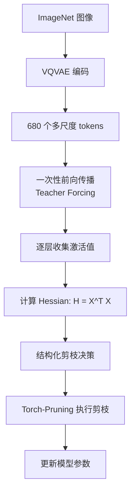

# VAR 模型剪枝校准数据收集完整指南

> 基于前期讨论总结的 VAR（Visual AutoRegressive）模型剪枝技术文档
>
> 适用场景：对 VAR 模型进行结构化剪枝，减少模型参数和计算量

---

## 目录

1. [快速开始](#1-快速开始)
2. [理论基础](#2-理论基础)
3. [VAR vs LLM 剪枝对比](#3-var-vs-llm-剪枝对比)
4. [校准数据收集详细实现](#4-校准数据收集详细实现)
5. [结构化剪枝实现](#5-结构化剪枝实现)
6. [完整代码示例](#6-完整代码示例)
7. [常见问题与调试](#7-常见问题与调试)
8. [创新方案](#8-创新方案)

---

## 1. 快速开始

### 1.1 核心流程图



### 1.2 5分钟上手代码

```python
import torch
from models import build_vae_var

# 1. 加载模型
vae, var = build_vae_var(
    V=4096, Cvae=32, ch=160,
    device='cuda', patch_nums=(1,2,3,4,5,6,8,10,13,16),
    num_classes=1000, depth=16
)

# 2. 准备校准数据（使用类别标签模拟）
calibration_data = torch.arange(0, 256).cuda()  # 256 个类别标签

# 3. 收集激活值并剪枝
from model_slimming import model_slimming
pruned_model = model_slimming(var, calibration_data, args)

# 4. 保存剪枝后的模型
torch.save(pruned_model.state_dict(), 'var_pruned.pth')
```

### 1.3 关键参数速查表

| 参数 | 默认值 | 说明 |
|------|--------|------|
| `num_samples` | 256 | 校准样本数量（图像数） |
| `sparsity` | 0.2 | 剪枝比例（20%） |
| `minlayer` / `maxlayer` | 0 / 16 | 剪枝层范围 |
| `percdamp` | 0.01 | Hessian 阻尼系数 |
| `prune_method` | "slimgpt" | 剪枝方法（slimgpt/magnitude/taylor） |
| `seq_length` | 680 | VAR 固定序列长度 |
| `hidden_size` | 1024 | VAR 隐藏层维度 |

---

## 2. 理论基础

### 2.1 Teacher Forcing 与剪枝的关系

#### 训练场景（Teacher Forcing）

```python
# 训练时：计算 loss 和梯度
input_ids = [BOS, "我", "爱", "机", "器", "学"]
labels    = ["我", "爱", "机", "器", "学", "习"]

logits = model(input_ids)
loss = cross_entropy(logits, labels)  # 与真实标签比较
loss.backward()                        # 计算梯度 ∂L/∂W
optimizer.step()                       # 更新参数
```

**特点**：
- ✅ 需要真实标签
- ✅ 计算 loss 和梯度
- ✅ 目的是更新参数

#### 剪枝场景（类 Teacher Forcing 执行）

```python
# 剪枝时：收集激活值统计量
input_ids = [BOS, "我", "爱", "机", "器", "学", "习"]

with torch.no_grad():  # ← 不需要梯度！
    activations = model(input_ids)

    # 在每层收集
    for layer_idx, layer in enumerate(layers):
        layer_input = activations[layer_idx]

        # 计算 Hessian 近似（不是梯度！）
        H = layer_input.T @ layer_input  # X^T X
```

**特点**：
- ❌ 不需要真实标签（对 VAR 只需类别标签）
- ❌ 不计算 loss 和梯度
- ✅ 目的是评估权重重要性

### 2.2 为什么使用批量前向传播？

| 方案 | 优点 | 缺点 | 适用性 |
|------|------|------|--------|
| **批量前向传播**<br/>（当前方法） | • 快速（分钟级）<br/>• 可收集大量样本<br/>• 实现简单 | • 与真实推理有分布差异 | ✅ 实际可行 |
| **Autoregressive 生成**<br/>（理想方案） | • 完全匹配推理分布<br/>• 理论最优 | • 极慢（天级）<br/>• 样本量受限 | ❌ 不现实 |

**工程权衡**：
- 批量前向传播快 **2000 倍**
- 统计平均下，分布差异可接受
- 主流方法（GPTQ, SparseGPT）都采用此方式

### 2.3 Hessian 近似原理

对于线性层 `Y = WX`：

```
真实 Hessian:  H = ∂²L/∂W²

Gauss-Newton 近似:  H ≈ E[X·X^T] = (1/n)Σ X_i·X_i^T
```

**代码实现**：

```python
class SlimGPT:
    def __init__(self, layer):
        self.H = torch.zeros((columns, columns), device=device)
        self.nsamples = 0

    def add_batch(self, inp, out):
        # inp: 层输入激活 X，shape: [batch, seq, hidden]
        inp = inp.reshape(-1, inp.shape[-1]).t()  # [hidden, batch*seq]

        # 累积 X^T X
        self.H *= self.nsamples / (self.nsamples + batch_size)
        self.nsamples += batch_size
        inp = math.sqrt(2 / self.nsamples) * inp
        self.H += inp @ inp.t()  # ← 核心：累积 Hessian
```

**关键点**：
- 不是训练梯度 `∂L/∂W`
- 是激活值的二阶统计量 `X^T X`
- 用于估计权重被删除后的影响

---

## 3. VAR vs LLM 剪枝对比

### 3.1 架构差异

| 特性 | LLM (LLaMA) | VAR (Visual AutoRegressive) |
|------|-------------|---------------------------|
| **输入数据** | 文本 token 序列 | 多尺度图像 token 金字塔 |
| **数据来源** | WikiText2, C4, Alpaca | ImageNet 图像数据集 |
| **预处理** | Tokenizer 分词 | VQVAE 编码 |
| **序列长度** | 固定（如 2048） | 固定 680 tokens |
| **序列结构** | 线性一维序列 | 分层金字塔（10 个尺度） |
| **生成方式** | 逐 token 生成 | 逐尺度生成（10 个阶段） |
| **条件输入** | 无 | 类别标签（1000 类） |
| **Hidden size** | 4096 (LLaMA-7B) | 1024 (VAR-d16) |
| **Attention heads** | 32 | 16 |

### 3.2 序列结构对比

#### LLM 序列结构

```
线性序列：
[BOS] [The] [quick] [brown] [fox] ... [EOS]
  ↓     ↓      ↓       ↓      ↓         ↓
  0     1      2       3      4    ...  2047

Attention mask：简单的因果 mask（下三角矩阵）
```

#### VAR 序列结构

```
多尺度金字塔：
Scale 1:  [1×1 = 1 token]
Scale 2:  [2×2 = 4 tokens]
Scale 3:  [3×3 = 9 tokens]
...
Scale 10: [16×16 = 256 tokens]
Total:    680 tokens

Attention mask：多尺度因果 mask
- Scale 2 可以看 Scale 1 + 当前 scale 前面的 tokens
- Scale 3 可以看 Scale 1,2 + 当前 scale 前面的 tokens
- ...
```

### 3.3 数据流对比

#### LLM 数据流

```python
# 输入：文本
text = "The capital of France is Paris."
tokens = tokenizer.encode(text)  # [1, 450, 7483, 310, 3444, ...]

# 前向传播
hidden_states = llama(tokens)  # (1, seq_len, 4096)

# 收集激活
for layer in llama.layers:
    layer_input = hidden_states[layer_idx]
    H = layer_input.T @ layer_input
```

#### VAR 数据流

```python
# 输入：图像
image = load_image("cat.jpg")  # (3, 256, 256)
label = 281  # ImageNet 类别：猫

# VQVAE 编码
gt_idx_Bl = vae.img_to_idxBl(image)  # List of 10 tensors
# [
#   tensor([42]),           # Scale 1: 1 token
#   tensor([13, 56, 89, 12]), # Scale 2: 4 tokens
#   ...
# ]

# 转换为 VAR 输入
x_BLCv = quantize.idxBl_to_var_input(gt_idx_Bl)  # (1, 679, 32)

# 前向传播
hidden_states = var(label, x_BLCv)  # (1, 680, 1024)

# 收集激活
for block in var.blocks:
    layer_input = hidden_states[block_idx]
    H = layer_input.T @ layer_input
```

### 3.4 校准数据收集策略对比

| 步骤 | LLM | VAR |
|------|-----|-----|
| **1. 数据加载** | 加载文本数据集 | 加载 ImageNet 图像 |
| **2. 预处理** | Tokenizer 分词 | VQVAE 编码到 680 tokens |
| **3. 采样** | 随机切片 2048 tokens | 随机采样 256-512 张图像 |
| **4. 批量大小** | 1-4（长序列） | 4-8（VAR 模型大） |
| **5. 前向传播** | `model(input_ids)` | `model(label, x_BLCv)` |
| **6. use_cache** | `False` | `False` |
| **7. Catcher 位置** | 替换 `layers[0]` | 不需要 Catcher* |
| **8. 激活收集** | Hook 每一层 | Hook 每个 block |

*注：VAR 可以直接对 `model(label)` 前向传播收集，因为输入是类别标签（可以直接迭代）

### 3.5 相似之处

✅ **都使用 Teacher Forcing 模式**：
- 一次性前向传播完整序列
- 使用 causal mask 保证因果性
- 设置 `use_cache=False`

✅ **都收集激活值统计量**：
- 计算 Hessian 近似 `H = X^T X`
- 不计算训练梯度
- 用于评估权重重要性

✅ **都使用结构化剪枝**：
- 按通道/头维度剪枝
- 保持模型结构完整
- 可继续训练微调

---

## 4. 校准数据收集详细实现

### 4.1 VAR 模型结构概览

```python
VAR(
  (word_embed): Linear(32, 1024)              # Token embedding
  (class_emb): Embedding(1001, 1024)          # Class conditioning
  (lvl_embed): Embedding(10, 1024)            # Level (scale) embedding
  (blocks): ModuleList(
    (0-15): 16 x AdaLNSelfAttn(
      (attn): Attention(
        (mat_qkv): Linear(1024, 3072)         # ← 剪枝目标 1
        (proj): Linear(1024, 1024)            # ← 剪枝目标 2
      )
      (ffn): FFN(
        (fc1): Linear(1024, 4096)             # ← 剪枝目标 3
        (fc2): Linear(4096, 1024)             # ← 剪枝目标 4
      )
    )
  )
  (head): AdaLNBeforeHead(...)
)
```

### 4.2 完整数据预处理流程

#### 步骤 1: 加载 ImageNet 数据

```python
from torchvision import datasets, transforms

# 数据变换
transform = transforms.Compose([
    transforms.Resize(256),
    transforms.CenterCrop(256),
    transforms.ToTensor(),
    transforms.Normalize(mean=[0.5, 0.5, 0.5], std=[0.5, 0.5, 0.5])  # [-1, 1]
])

# 加载数据集
imagenet_train = datasets.ImageFolder(
    root='/path/to/imagenet/train',
    transform=transform
)

# 创建 dataloader
calibration_loader = torch.utils.data.DataLoader(
    imagenet_train,
    batch_size=8,
    shuffle=True,
    num_workers=4,
    pin_memory=True
)

# 限制样本数量
num_calibration_batches = 32  # 32 batches × 8 = 256 images
```

#### 步骤 2: VQVAE 编码到 680 tokens

```python
@torch.no_grad()
def encode_images_to_tokens(vae, images):
    """
    将图像编码为多尺度 token 序列

    Args:
        vae: VQVAE 模型
        images: (B, 3, 256, 256)

    Returns:
        gt_idx_Bl: List of 10 tensors, 每个是一个尺度的 token indices
        x_BLCv: (B, 679, 32) 用于 VAR 输入的 token embeddings
    """
    # 编码到 token indices
    gt_idx_Bl = vae.img_to_idxBl(images)
    # gt_idx_Bl = [
    #     tensor([[42]]),              # Scale 1: (B, 1)
    #     tensor([[13, 56, 89, 12]]),  # Scale 2: (B, 4)
    #     ...
    #     tensor([[...256 tokens...]]) # Scale 10: (B, 256)
    # ]

    # 拼接为完整序列
    gt_BL = torch.cat(gt_idx_Bl, dim=1)  # (B, 680)

    # 转换为 VAR 输入格式（去掉第一个尺度）
    x_BLCv = vae.quantize.idxBl_to_var_input(gt_idx_Bl)  # (B, 679, 32)

    return gt_idx_Bl, x_BLCv
```

#### 步骤 3: VAR 前向传播（Teacher Forcing）

```python
@torch.no_grad()
def forward_var_teacher_forcing(var_model, labels, x_BLCv):
    """
    VAR 的一次性前向传播

    Args:
        var_model: VAR 模型
        labels: (B,) 类别标签
        x_BLCv: (B, 679, 32) token embeddings

    Returns:
        logits: (B, 680, 4096) 每个位置的预测
        hidden_states: List of (B, 680, 1024) 每层的隐藏状态
    """
    # 关闭 KV-cache（Teacher Forcing 模式）
    for block in var_model.blocks:
        block.attn.kv_caching(False)

    # 前向传播
    logits = var_model(labels, x_BLCv)  # (B, 680, 4096)

    return logits
```

### 4.3 激活值收集策略

#### 方案 A：使用 Forward Hook（推荐）

```python
@torch.no_grad()
def collect_var_activations(var_model, calibration_loader, num_batches, device='cuda'):
    """
    收集 VAR 模型的激活值用于剪枝
    """
    # 存储每一层的激活值
    layer_inputs = [[] for _ in range(len(var_model.blocks))]
    layer_outputs = [[] for _ in range(len(var_model.blocks))]

    # 定义 hook 函数
    def make_hook(layer_idx):
        def hook(module, inp, out):
            # inp 是 tuple，取第一个元素
            layer_inputs[layer_idx].append(inp[0].detach().cpu())
            layer_outputs[layer_idx].append(out.detach().cpu())
        return hook

    # 注册 hooks
    handles = []
    for idx, block in enumerate(var_model.blocks):
        handle = block.register_forward_hook(make_hook(idx))
        handles.append(handle)

    # 收集数据
    print("开始收集激活值...")
    for batch_idx, (images, labels) in enumerate(calibration_loader):
        if batch_idx >= num_batches:
            break

        images = images.to(device)
        labels = labels.to(device)

        # VQVAE 编码
        gt_idx_Bl = var_model.vae_proxy[0].img_to_idxBl(images)
        x_BLCv = var_model.vae_quant_proxy[0].idxBl_to_var_input(gt_idx_Bl)

        # 前向传播（自动触发 hooks）
        _ = var_model(labels, x_BLCv)

        print(f"已收集 {batch_idx+1}/{num_batches} 批次")

    # 移除 hooks
    for handle in handles:
        handle.remove()

    # 合并所有批次
    for i in range(len(var_model.blocks)):
        layer_inputs[i] = torch.cat(layer_inputs[i], dim=0)  # (total_samples, 680, 1024)
        layer_outputs[i] = torch.cat(layer_outputs[i], dim=0)

    print(f"收集完成：{layer_inputs[0].shape[0]} 个样本，序列长度 {layer_inputs[0].shape[1]}")
    return layer_inputs, layer_outputs
```

#### 方案 B：直接使用类别标签（快速测试）

基于 `tp_prune_reference.py` 的方法：

```python
# 简化方案：直接使用类别标签作为输入
# VAR 会内部处理 VQVAE 编码
calibration_data = torch.arange(0, 256).cuda()  # 256 个类别

@torch.no_grad()
def collect_var_activations_simple(var_model, labels, num_samples):
    """
    简化版：直接使用类别标签
    VAR 会自动生成图像并编码
    """
    layer_inputs = [[] for _ in range(len(var_model.blocks))]

    # 注册 hooks
    def make_hook(layer_idx):
        def hook(module, inp, out):
            layer_inputs[layer_idx].append(inp[0].detach())
        return hook

    handles = [block.register_forward_hook(make_hook(i))
               for i, block in enumerate(var_model.blocks)]

    # 启用 KV-cache 加速
    for block in var_model.blocks:
        block.attn.kv_caching(True)

    # 批量前向传播
    batch_size = 16
    for i in range(0, num_samples, batch_size):
        batch_labels = labels[i:i+batch_size]
        _ = var_model(batch_labels)

    # 清理
    for block in var_model.blocks:
        block.attn.kv_caching(False)
    for handle in handles:
        handle.remove()

    return layer_inputs
```

### 4.4 内存管理策略

#### GPU 显存充足

```python
cache_dev = 'cuda'
layer_inputs = torch.zeros(num_samples, 680, 1024, device='cuda')

# 优点：速度快
# 缺点：需要大量显存（256 samples × 680 × 1024 × 4 bytes ≈ 680 MB）
```

#### GPU 显存不足

```python
cache_dev = 'cpu'
layer_inputs = torch.zeros(num_samples, 680, 1024, device='cpu')

# 分批加载到 GPU
batch_size = 32
for i in range(0, num_samples, batch_size):
    batch_data = layer_inputs[i:i+batch_size].cuda()
    # ... 处理 ...
    layer_inputs[i:i+batch_size] = batch_data.cpu()

# 优点：显存占用小
# 缺点：速度较慢（CPU-GPU 传输开销）
```

### 4.5 特殊注意事项

#### 1. 多尺度 Causal Mask

```python
# VAR 的 attention mask 比 LLM 更复杂
# 在 var.py 中自动处理

# Scale 1 (1 token):   只能看自己
# Scale 2 (4 tokens):  可以看 Scale 1 + 当前前面的
# Scale 3 (9 tokens):  可以看 Scale 1,2 + 当前前面的
# ...

# 代码中通过 _ar_mask 属性实现
mask = var_model._ar_mask  # 自动生成的多尺度 mask
```

#### 2. 类别条件（Class Conditioning）

```python
# VAR 是条件生成模型，需要类别标签
labels = torch.randint(0, 1000, (batch_size,)).cuda()

# 在模型内部：
class_emb = self.class_emb(labels)  # (B, 1024)
# 通过 AdaLN 融入每一层
```

#### 3. 位置编码 + 尺度编码

```python
# VAR 使用两种 embedding：
# 1. 位置编码：pos_1LC (1, 680, 1024)
# 2. 尺度编码：lvl_embed (10, 1024)

# 在每个 token 位置添加：
x = x + pos_1LC[:, token_idx, :]
x = x + lvl_embed[scale_idx, :]
```

---

## 5. 结构化剪枝实现

### 5.1 目标层分析

基于 `tp_prune_reference.py` 的实现，VAR 剪枝的目标层：

```python
sequential = [
    ["attn.proj"],   # 注意力输出投影
    ["ffn.fc2"],     # FFN 下投影
]
```

**剪枝策略**：
1. 先评估 `attn.proj` 和 `ffn.fc2` 的输入重要性
2. 根据 Hessian 决定剪掉哪些输入通道
3. 联动剪枝相关的输出通道：
   - `attn.proj` 输入 → `attn.mat_qkv` 输出（QKV）
   - `ffn.fc2` 输入 → `ffn.fc1` 输出

### 5.2 剪枝层的依赖关系

```
Block i:
  ┌─────────────────────────────────┐
  │ Attention                        │
  │   mat_qkv: (1024, 3072)         │  ← 输出通道被剪
  │       ↓                          │
  │   Q,K,V split: 3 × (1024, 1024) │
  │       ↓                          │
  │   MultiHeadAttention             │
  │       ↓                          │
  │   proj: (1024, 1024)            │  ← 输入通道被剪
  └─────────────────────────────────┘

  ┌─────────────────────────────────┐
  │ FFN                             │
  │   fc1: (1024, 4096)             │  ← 输出通道被剪
  │       ↓                          │
  │   GELU activation                │
  │       ↓                          │
  │   fc2: (4096, 1024)             │  ← 输入通道被剪
  └─────────────────────────────────┘
```

### 5.3 Attention 层剪枝

#### 步骤 1: 评估 proj 层输入重要性

```python
# 收集 proj 层的输入输出
pruner_proj = SlimGPT(block.attn.proj, layer_idx, args)

# 注册 hook
def add_batch_proj(_, inp, out):
    pruner_proj.add_batch(inp[0].data, out.data)

handle = block.attn.proj.register_forward_hook(add_batch_proj)

# 前向传播收集数据
for batch in calibration_loader:
    _ = var_model(batch)

handle.remove()
```

#### 步骤 2: 执行剪枝决策

```python
# 计算需要剪枝的索引
sparsity = 0.2  # 剪掉 20%
headsize = 64   # 每个 head 的维度

idx = pruner_proj.struct_prune(
    sparsity=sparsity,
    percdamp=0.01,
    headsize=headsize,  # 按 head 维度剪枝
    layer_idx=layer_idx,
)
# idx: 需要剪掉的输入通道索引 (tensor)
```

#### 步骤 3: 执行 Torch-Pruning

```python
import torch_pruning as tp

# 1. 剪枝 proj 的输入通道
idx_list = idx.tolist()
tp.prune_linear_in_channels(block.attn.proj, idx_list)

# 2. 联动剪枝 mat_qkv 的输出通道
# mat_qkv 输出维度：[1024 (Q) | 1024 (K) | 1024 (V)] = 3072
hidden = 1024
rm_feat_q = idx  # 需要剪掉的通道索引

# 映射到 QKV 的合并输出索引
rm_qkv = torch.cat([
    rm_feat_q,              # Q 部分
    rm_feat_q + hidden,     # K 部分
    rm_feat_q + 2*hidden    # V 部分
], dim=0)

rm_qkv_list = torch.unique(rm_qkv).sort().values.tolist()
tp.prune_linear_out_channels(block.attn.mat_qkv, rm_qkv_list)

# 3. 更新 head 数量和相关参数
num_heads_before = 16
num_heads_after = int(num_heads_before * (1 - sparsity))
block.attn.num_heads = num_heads_after

# 更新 bias 参数
keep_idxs = list(set(range(1024)) - set(idx_list))
block.attn.q_bias = nn.Parameter(block.attn.q_bias.data[keep_idxs])
block.attn.v_bias = nn.Parameter(block.attn.v_bias.data[keep_idxs])
block.attn.zero_k_bias = block.attn.zero_k_bias.data[keep_idxs]

# 更新 scale 参数
block.attn.scale_mul_1H11 = nn.Parameter(
    torch.full((1, num_heads_after, 1, 1), fill_value=4.0, device='cuda').log(),
    requires_grad=True
)
```

### 5.4 FFN 层剪枝

#### 步骤 1: 评估 fc2 层输入重要性

```python
# 收集 fc2 层的输入输出
pruner_fc2 = SlimGPT(block.ffn.fc2, layer_idx, args)

def add_batch_fc2(_, inp, out):
    pruner_fc2.add_batch(inp[0].data, out.data)

handle = block.ffn.fc2.register_forward_hook(add_batch_fc2)

# 前向传播
for batch in calibration_loader:
    _ = var_model(batch)

handle.remove()
```

#### 步骤 2: 执行剪枝

```python
# 计算剪枝索引
idx = pruner_fc2.struct_prune(
    sparsity=0.2,
    percdamp=0.01,
    headsize=1,  # FFN 不按 head，按单个通道
    layer_idx=layer_idx,
)

# 剪枝 fc2 的输入通道
idx_list = idx.tolist()
tp.prune_linear_in_channels(block.ffn.fc2, idx_list)

# 联动剪枝 fc1 的输出通道
tp.prune_linear_out_channels(block.ffn.fc1, idx_list)
```

### 5.5 完整剪枝流程

```python
@torch.no_grad()
def model_slimming(var_model, calibration_loader, args):
    """
    对 VAR 模型执行结构化剪枝
    """
    device = 'cuda' if torch.cuda.is_available() else 'cpu'
    layers = var_model.blocks

    print("开始剪枝...")
    for i in range(len(layers)):
        layer = layers[i].to(device)

        if args.minlayer <= i < args.maxlayer:
            # 找到所有线性层
            all_module_dict = find_layers(layer)

            # 按顺序剪枝
            sequential = [
                ["attn.proj"],
                ["ffn.fc2"],
            ]

            for names in sequential:
                module_dict = {name: all_module_dict[name] for name in names}
                pruner_dict = {}

                # 1. 初始化剪枝器
                for name in module_dict:
                    pruner_dict[name] = SlimGPT(module_dict[name], i, args)

                # 2. 注册 hook 收集激活值
                def make_add_batch(name):
                    def func(_, inp, out):
                        pruner_dict[name].add_batch(inp[0].data, out.data)
                    return func

                handles = []
                for name in module_dict:
                    handle = module_dict[name].register_forward_hook(make_add_batch(name))
                    handles.append(handle)

                # 3. 前向传播收集数据
                for block in var_model.blocks:
                    block.attn.kv_caching(True)

                for batch in calibration_loader:
                    _ = var_model(batch)

                for block in var_model.blocks:
                    block.attn.kv_caching(False)

                # 4. 移除 hooks
                for h in handles:
                    h.remove()

                # 5. 执行剪枝
                for name in module_dict:
                    sparsity = args.sparsity[i] if isinstance(args.sparsity, list) else args.sparsity
                    print(f"Layer {i}: {name} 剪枝比例 {sparsity}")

                    # 计算剪枝索引
                    idx = pruner_dict[name].struct_prune(
                        sparsity=sparsity,
                        percdamp=args.percdamp,
                        headsize=64 if name == "attn.proj" else 1,
                        layer_idx=i,
                    )

                    # 执行 Torch-Pruning
                    target_layer = get_module_by_name(var_model.blocks[i], name)

                    if name == "ffn.fc2":
                        # FFN 剪枝
                        target_layer_b = get_module_by_name(var_model.blocks[i], "ffn.fc1")
                        idx_list = idx.tolist()
                        tp.prune_linear_in_channels(target_layer, idx_list)
                        tp.prune_linear_out_channels(target_layer_b, idx_list)

                    elif name == "attn.proj":
                        # Attention 剪枝
                        # 更新 head 数量
                        var_model.blocks[i].attn.num_heads = int(16 * (1 - sparsity))

                        # 剪枝 proj 输入通道
                        idx_list = idx.tolist()
                        keep_idxs = list(set(range(1024)) - set(idx_list))
                        tp.prune_linear_in_channels(target_layer, idx_list)

                        # 更新 bias
                        var_model.blocks[i].attn.q_bias = nn.Parameter(
                            var_model.blocks[i].attn.q_bias.data[keep_idxs]
                        )
                        var_model.blocks[i].attn.v_bias = nn.Parameter(
                            var_model.blocks[i].attn.v_bias.data[keep_idxs]
                        )
                        var_model.blocks[i].attn.zero_k_bias = \
                            var_model.blocks[i].attn.zero_k_bias.data[keep_idxs]

                        # 更新 scale
                        var_model.blocks[i].attn.scale_mul_1H11 = nn.Parameter(
                            torch.full(
                                (1, var_model.blocks[i].attn.num_heads, 1, 1),
                                fill_value=4.0, device='cuda'
                            ).log(),
                            requires_grad=True
                        )

                        # 剪枝 mat_qkv 输出通道
                        target_layer_b = get_module_by_name(var_model.blocks[i], "attn.mat_qkv")
                        idx_m = idx.to(dtype=torch.long)
                        rm_qkv = torch.cat([idx_m, idx_m + 1024, idx_m + 2048], dim=0)
                        rm_qkv_list = torch.unique(rm_qkv).sort().values.tolist()
                        tp.prune_linear_out_channels(target_layer_b, rm_qkv_list)

                    pruner_dict[name].free()

                del pruner_dict

        # 输出剪枝后的形状
        print(f"Layer {i} 剪枝后:")
        print(f"  ffn.fc1: {var_model.blocks[i].ffn.fc1.weight.shape}")
        print(f"  ffn.fc2: {var_model.blocks[i].ffn.fc2.weight.shape}")
        print(f"  attn.mat_qkv: {var_model.blocks[i].attn.mat_qkv.weight.shape}")
        print(f"  attn.proj: {var_model.blocks[i].attn.proj.weight.shape}")

        del layer
        torch.cuda.empty_cache()

    return var_model
```

---

## 6. 完整代码示例

### 6.1 完整的剪枝脚本

```python
#!/usr/bin/env python3
"""
VAR 模型结构化剪枝脚本
基于 SlimGPT + Torch-Pruning 实现
"""

import time
import os
import torch
import torch.nn as nn
import numpy as np
import argparse
from transformers import set_seed
import os.path as osp
import torch_pruning as tp

from models import build_vae_var
from slim_utils.slimgpt import SlimGPT

def find_layers(module, layers=[nn.Conv2d, nn.Linear], name=''):
    """递归查找所有线性层"""
    if type(module) in layers:
        return {name: module}
    res = {}
    for name1, child in module.named_children():
        res.update(find_layers(
            child, layers=layers,
            name=name + '.' + name1 if name != '' else name1
        ))
    return res

def get_module_by_name(layer, name):
    """根据名称获取模块"""
    module = layer
    for attr in name.split('.'):
        module = getattr(module, attr)
    return module

def check_sparsity(model):
    """检查模型的稀疏度"""
    layers = model.blocks
    count = 0
    total_params = 0

    for i in range(len(layers)):
        layer = layers[i]
        subset = find_layers(layer)

        sub_count = 0
        sub_params = 0
        for name in subset:
            W = subset[name].weight.data
            count += (W == 0).sum().item()
            total_params += W.numel()
            sub_count += (W == 0).sum().item()
            sub_params += W.numel()

        print(f"Layer {i} 稀疏度: {float(sub_count)/sub_params:.6f}")

    return float(count) / total_params

@torch.no_grad()
def model_slimming(model, dataloader, args):
    """
    执行 VAR 模型剪枝
    """
    device = "cuda" if torch.cuda.is_available() else 'cpu'
    layers = model.blocks

    print("开始剪枝...")
    t1 = time.time()

    for i in range(len(layers)):
        layer = layers[i].to(device)

        if args.minlayer <= i < args.maxlayer:
            all_module_dict = find_layers(layer)

            # 按顺序剪枝
            sequential = [
                ["attn.proj"],
                ["ffn.fc2"],
            ]

            for names in sequential:
                module_dict = {name: all_module_dict[name] for name in names}
                pruner_dict = {}

                # 初始化剪枝器
                for name in module_dict:
                    pruner_dict[name] = SlimGPT(module_dict[name], i, args)

                # 注册 hooks
                handles = []
                for name in module_dict:
                    def make_hook(pname):
                        def func(_, inp, out):
                            pruner_dict[pname].add_batch(inp[0].data, out.data)
                        return func
                    handles.append(module_dict[name].register_forward_hook(make_hook(name)))

                # 启用 KV-cache
                for b in model.blocks:
                    b.attn.kv_caching(True)

                # 前向传播收集激活值
                for batch_idx, batch in enumerate(dataloader):
                    model(batch)

                # 关闭 KV-cache
                for b in model.blocks:
                    b.attn.kv_caching(False)

                # 移除 hooks
                for h in handles:
                    h.remove()

                # 执行剪枝
                for name in module_dict:
                    sparsity = args.sparsity[i] if isinstance(args.sparsity, list) else args.sparsity
                    print(f"Layer {i}: {name} 稀疏度 {sparsity}")

                    idx = pruner_dict[name].struct_prune(
                        sparsity=sparsity,
                        percdamp=args.percdamp,
                        headsize=64 if name == "attn.proj" else 1,
                        layer_idx=i,
                    )

                    pruner_dict[name].free()

                    # Torch-Pruning 执行
                    target_layer = get_module_by_name(model.blocks[i], name)

                    if name == "ffn.fc2":
                        target_layer_b = get_module_by_name(model.blocks[i], "ffn.fc1")
                        idx_list = idx.tolist()
                        tp.prune_linear_in_channels(target_layer, idx_list)
                        tp.prune_linear_out_channels(target_layer_b, idx_list)

                    elif name == "attn.proj":
                        model.blocks[i].attn.num_heads = int(16 * (1 - sparsity))
                        idx_list = idx.tolist()
                        keep_idxs = list(set(range(target_layer.in_features)) - set(idx_list))

                        # 更新参数
                        model.blocks[i].attn.q_bias = nn.Parameter(
                            model.blocks[i].attn.q_bias.data[keep_idxs]
                        )
                        model.blocks[i].attn.v_bias = nn.Parameter(
                            model.blocks[i].attn.v_bias.data[keep_idxs]
                        )
                        zero_k_bias = model.blocks[i].attn.zero_k_bias.data[keep_idxs]
                        model.blocks[i].attn.register_buffer('zero_k_bias', zero_k_bias)

                        model.blocks[i].attn.scale_mul_1H11 = nn.Parameter(
                            torch.full(
                                size=(1, model.blocks[i].attn.num_heads, 1, 1),
                                fill_value=4.0, device='cuda'
                            ).log(),
                            requires_grad=True
                        )

                        target_layer_b = get_module_by_name(model.blocks[i], "attn.mat_qkv")
                        tp.prune_linear_in_channels(target_layer, idx_list)

                        hidden = 16 * 64
                        rm_feat_q = idx.to(dtype=torch.long)
                        rm_qkv = torch.cat([
                            rm_feat_q,
                            rm_feat_q + hidden,
                            rm_feat_q + 2*hidden
                        ], dim=0)
                        rm_qkv_list = torch.unique(rm_qkv.to("cpu")).sort().values.tolist()
                        tp.prune_linear_out_channels(target_layer_b, rm_qkv_list)

            del pruner_dict

            # 输出剪枝后的形状
            print(f"Layer {i} 剪枝后:")
            print(f"  ffn.fc1: {model.blocks[i].ffn.fc1.weight.shape}")
            print(f"  ffn.fc2: {model.blocks[i].ffn.fc2.weight.shape}")
            print(f"  attn.mat_qkv: {model.blocks[i].attn.mat_qkv.weight.shape}")
            print(f"  attn.proj: {model.blocks[i].attn.proj.weight.shape}")

        del layer
        torch.cuda.empty_cache()

    print(f"剪枝完成，耗时: {time.time() - t1:.2f}s")
    return model

def main(args):
    print('加载模型...')

    MODEL_DEPTH = args.maxlayer
    assert MODEL_DEPTH in {16, 20, 24, 30}

    vae_ckpt = '/path/to/vae_ch160v4096z32.pth'
    var_ckpt = f'/path/to/var_d{MODEL_DEPTH}.pth'

    patch_nums = (1, 2, 3, 4, 5, 6, 8, 10, 13, 16)
    device = 'cuda' if torch.cuda.is_available() else 'cpu'

    # 构建模型
    vae, var = build_vae_var(
        V=4096, Cvae=32, ch=160, share_quant_resi=4,
        device=device, patch_nums=patch_nums,
        num_classes=1000, depth=MODEL_DEPTH, shared_aln=False
    )

    vae.load_state_dict(torch.load(vae_ckpt, map_location='cpu'), strict=True)
    var.load_state_dict(torch.load(var_ckpt, map_location='cpu'), strict=False)

    vae.eval()
    var.eval()
    for p in vae.parameters():
        p.requires_grad_(False)
    for p in var.parameters():
        p.requires_grad_(False)

    print('模型加载完成')

    # 设置剪枝参数
    args.minlayer = max(args.minlayer, 0)
    args.maxlayer = min(args.maxlayer, MODEL_DEPTH)

    if args.non_uniform:
        # 非均匀剪枝策略
        assert 0 <= args.min_sparsity <= args.max_sparsity < 1
        if args.non_uniform_strategy in ('log_increase', 'log_decrease'):
            linear_space = np.arange(0, args.maxlayer - args.minlayer)
            args.sparsity = args.min_sparsity + \
                (args.max_sparsity - args.min_sparsity) / np.log(32) * np.log(1 + linear_space)
            args.sparsity = [0] * args.minlayer + list(args.sparsity)
            if args.non_uniform_strategy == 'log_decrease':
                args.sparsity = args.sparsity[::-1]

    # 准备校准数据
    print('准备校准数据...')
    calibration_data = torch.arange(0, args.num_samples).cuda()

    # 执行剪枝
    if isinstance(args.sparsity, list) or args.sparsity >= 0:
        print('开始剪枝...')
        var = model_slimming(var, calibration_data, args)

    # 检查稀疏度
    print("=" * 50)
    sparsity_ratio = check_sparsity(var)
    print(f"总体稀疏度: {sparsity_ratio:.4f}")
    print("=" * 50)

    # 保存模型
    save_path = os.path.join(args.save_dir, args.model_name)
    os.makedirs(os.path.dirname(save_path), exist_ok=True)
    torch.save(var.state_dict(), save_path)
    print(f"模型已保存到: {save_path}")

    # 评估参数量和计算量
    example_input = torch.tensor([0]).to(device)
    for b in var.blocks:
        b.attn.kv_caching(True)

    macs, nparams = tp.utils.count_ops_and_params(var, example_input)
    print(f"参数量: {nparams / 1e6:.2f} M")
    print(f"计算量: {macs / 1e9:.2f} G MACs")

if __name__ == "__main__":
    parser = argparse.ArgumentParser()

    parser.add_argument("--num_samples", type=int, default=256,
                        help="校准样本数量")
    parser.add_argument("--sparsity", type=float, default=0.2,
                        help="剪枝比例")
    parser.add_argument("--minlayer", type=int, default=0,
                        help="起始剪枝层")
    parser.add_argument("--maxlayer", type=int, default=16,
                        help="结束剪枝层")
    parser.add_argument("--percdamp", type=float, default=0.01,
                        help="Hessian 阻尼系数")
    parser.add_argument("--non_uniform", action="store_true",
                        help="使用非均匀剪枝")
    parser.add_argument("--non_uniform_strategy", type=str, default='log_increase',
                        choices=["log_increase", "log_decrease"],
                        help="非均匀剪枝策略")
    parser.add_argument("--min_sparsity", type=float, default=0.06)
    parser.add_argument("--max_sparsity", type=float, default=0.3)
    parser.add_argument("--no_compensate", action="store_true",
                        help="跳过误差补偿")
    parser.add_argument("--seed", type=int, default=0)
    parser.add_argument("--save_dir", type=str, default="./pruned_models")
    parser.add_argument("--model_name", type=str, default="var_pruned.pth")

    args = parser.parse_args()
    print(args)
    set_seed(args.seed)

    main(args)
```

### 6.2 运行示例

```bash
# 基础剪枝：均匀 20% 稀疏度
python model_slimming_var.py \
    --num_samples 256 \
    --sparsity 0.2 \
    --minlayer 0 \
    --maxlayer 16 \
    --percdamp 0.01 \
    --save_dir ./pruned_models \
    --model_name var_d16_s20.pth

# 非均匀剪枝：浅层 6%，深层 30%，对数增长
python model_slimming_var.py \
    --num_samples 256 \
    --non_uniform \
    --non_uniform_strategy log_increase \
    --min_sparsity 0.06 \
    --max_sparsity 0.3 \
    --minlayer 0 \
    --maxlayer 16 \
    --save_dir ./pruned_models \
    --model_name var_d16_nonuniform.pth
```

---

## 7. 常见问题与调试

### 7.1 常见问题

#### Q1: OOM (Out of Memory) 错误

**原因**：VAR 模型较大（~300M 参数），校准数据占用显存过多

**解决方案**：
```python
# 方案 1: 减小 batch size
calibration_loader = DataLoader(dataset, batch_size=4)  # 从 8 降到 4

# 方案 2: 使用 CPU 缓存
args.cache_dev = 'cpu'
args.batch_samples = 32  # 每次加载到 GPU 的样本数

# 方案 3: 减少校准样本
args.num_samples = 128  # 从 256 降到 128
```

#### Q2: 剪枝后模型无法前向传播

**原因**：参数维度不匹配

**调试方法**：
```python
# 检查每层的参数形状
for i, block in enumerate(var.blocks):
    print(f"Block {i}:")
    print(f"  mat_qkv: {block.attn.mat_qkv.weight.shape}")
    print(f"  proj: {block.attn.proj.weight.shape}")
    print(f"  fc1: {block.ffn.fc1.weight.shape}")
    print(f"  fc2: {block.ffn.fc2.weight.shape}")
    print(f"  num_heads: {block.attn.num_heads}")

# 检查 bias 维度
print(f"  q_bias: {block.attn.q_bias.shape}")
print(f"  v_bias: {block.attn.v_bias.shape}")
```

**常见错误**：
- `proj.in_features` 与 `mat_qkv.out_features // 3` 不匹配
- `fc2.in_features` 与 `fc1.out_features` 不匹配
- `q_bias.shape[0]` 与 `proj.in_features` 不匹配

#### Q3: KV-cache 相关错误

**原因**：剪枝后 head 数量改变，但 KV-cache 没有更新

**解决方案**：
```python
# 剪枝后重置 KV-cache
for block in var.blocks:
    block.attn.kv_caching(False)  # 先关闭
    block.attn.kv = None          # 清空缓存
    block.attn.kv_caching(True)   # 重新启用
```

#### Q4: 校准数据不合理

**现象**：剪枝后性能严重下降（FID >> 原始模型）

**原因**：
- 使用随机类别标签，分布与真实数据不符
- 校准样本数量太少

**解决方案**：
```python
# 使用真实 ImageNet 数据
from torchvision import datasets, transforms

transform = transforms.Compose([
    transforms.Resize(256),
    transforms.CenterCrop(256),
    transforms.ToTensor(),
    transforms.Normalize([0.5, 0.5, 0.5], [0.5, 0.5, 0.5])
])

imagenet_train = datasets.ImageFolder(
    '/path/to/imagenet/train',
    transform=transform
)

calibration_loader = DataLoader(
    imagenet_train,
    batch_size=8,
    shuffle=True,
    num_workers=4
)

# 收集真实图像的激活值
for batch_idx, (images, labels) in enumerate(calibration_loader):
    if batch_idx >= 32:  # 256 images
        break
    images = images.cuda()
    labels = labels.cuda()
    # ... 前向传播 ...
```

### 7.2 调试技巧

#### 1. 可视化 Hessian 矩阵

```python
import matplotlib.pyplot as plt

# 在 SlimGPT.struct_prune() 中
H_diag = torch.diag(H).cpu().numpy()

plt.figure(figsize=(10, 4))
plt.plot(H_diag)
plt.xlabel('Channel Index')
plt.ylabel('Hessian Diagonal Value')
plt.title(f'Layer {layer_idx} Hessian Diagonal')
plt.savefig(f'hessian_layer_{layer_idx}.png')
```

#### 2. 验证剪枝索引

```python
# 在剪枝前后验证
print(f"原始形状: {layer.weight.shape}")
print(f"剪枝索引数量: {len(idx_list)}")
print(f"剪枝比例: {len(idx_list) / layer.weight.shape[1]:.2%}")

# 剪枝后
print(f"剪枝后形状: {layer.weight.shape}")
expected_size = original_size - len(idx_list)
assert layer.weight.shape[1] == expected_size, "维度不匹配！"
```

#### 3. 逐层测试

```python
# 只剪枝单层进行测试
args.minlayer = 5
args.maxlayer = 6  # 只剪枝第 5 层

var_pruned = model_slimming(var, calibration_data, args)

# 测试前向传播
test_input = torch.tensor([0]).cuda()
try:
    output = var_pruned(test_input)
    print("✓ 前向传播成功")
except Exception as e:
    print(f"✗ 前向传播失败: {e}")
```

### 7.3 性能评估

#### 1. FID 评估

```bash
# 使用 FID_test.py 评估图像质量
python FID_test.py \
    --model_path ./pruned_models/var_d16_s20.pth \
    --num_images 5000 \
    --batch_size 50 \
    --output_dir ./fid_results
```

#### 2. 推理速度测试

```python
import time

# 预热
for _ in range(10):
    _ = var_pruned(torch.tensor([0]).cuda())

# 测速
torch.cuda.synchronize()
start = time.time()

for _ in range(100):
    _ = var_pruned(torch.tensor([0]).cuda())

torch.cuda.synchronize()
end = time.time()

print(f"推理时间: {(end - start) / 100 * 1000:.2f} ms/image")
```

#### 3. 参数量和计算量

```python
import torch_pruning as tp

example_input = torch.tensor([0]).cuda()
macs, nparams = tp.utils.count_ops_and_params(var_pruned, example_input)

print(f"参数量: {nparams / 1e6:.2f} M")
print(f"计算量: {macs / 1e9:.2f} G MACs")

# 对比原始模型
macs_orig, nparams_orig = tp.utils.count_ops_and_params(var_original, example_input)
print(f"参数压缩率: {(1 - nparams / nparams_orig) * 100:.1f}%")
print(f"计算压缩率: {(1 - macs / macs_orig) * 100:.1f}%")
```

---

## 8. 创新方案

> **重要说明**：本章介绍基于VAR特性的创新剪枝方案，包括分尺度重要性分析、QKV/FC1补偿剪枝、渐进式剪枝等。这些功能通过参数控制，可以逐步启用。

### 8.1 方案概览

#### 8.1.1 设计理念

VAR模型的特殊性为剪枝提供了新的创新机会：
1. ✅ **Transformer层共享**：所有10个尺度共享同样的16层transformer
2. ✅ **多尺度token**：680个token来自10个不同的尺度
3. ✅ **条件生成**：基于类别标签的条件生成

#### 8.1.2 创新点总结

| 创新方案 | 核心思想 | 主要优势 | 实现难度 |
|----------|---------|----------|---------|
| **分尺度重要性分析** | 分析每个尺度对head/通道重要性的影响，找出跨尺度平均重要性低的部分 | 更准确的全局剪枝策略，避免局部最优 | ⭐⭐⭐ |
| **QKV/FC1补偿** | 在联动剪枝QKV/fc1前，将被剪通道的信息补偿到保留通道 | 减少剪枝误差，提升剪枝后质量 | ⭐⭐⭐⭐ |
| **渐进式剪枝** | 分多个阶段逐步增加稀疏度，每阶段重新评估重要性 | 更稳定，避免一次性剪枝过度 | ⭐⭐ |
| **轻量级评估** | 使用重构误差/KL散度替代FID进行中间评估 | 避免频繁的耗时FID评估 | ⭐ |

---

### 8.2 分尺度重要性分析

#### 8.2.1 核心思路

**问题**：虽然VAR的transformer层是共享的，但不同尺度的token对最终生成质量的影响可能不同。

**方案**：分别收集每个尺度位置的激活值，评估在不同尺度下head和通道的重要性，然后基于**跨尺度的平均重要性**进行全局剪枝。

#### 8.2.2 实现步骤

##### 步骤1：计算尺度token位置范围

```python
def compute_scale_ranges(patch_nums=(1, 2, 3, 4, 5, 6, 8, 10, 13, 16)):
    """
    计算每个尺度的token位置范围

    Returns:
        {1: (0, 1), 2: (1, 5), 3: (5, 14), ..., 10: (424, 680)}
    """
    scale_ranges = {}
    start = 0
    for scale_idx, pn in enumerate(patch_nums, 1):
        num_tokens = pn * pn
        end = start + num_tokens
        scale_ranges[scale_idx] = (start, end)
        start = end
    return scale_ranges

# 输出示例：
# Scale 1: tokens [0:1]     (1个token)
# Scale 2: tokens [1:5]     (4个token)
# Scale 3: tokens [5:14]    (9个token)
# ...
# Scale 10: tokens [424:680] (256个token)
```

##### 步骤2：分尺度收集激活值

```python
@torch.no_grad()
def collect_activations_by_scale(var_model, calibration_loader, num_samples=256):
    """
    分尺度收集激活值

    Returns:
        activations_by_scale: {
            'scale_1': {
                'layer_0': tensor([N, 1, 1024]),      # N个样本，1个token，1024维
                'layer_1': tensor([N, 1, 1024]),
                ...
            },
            'scale_2': {
                'layer_0': tensor([N, 4, 1024]),      # N个样本，4个token，1024维
                ...
            },
            ...
        }
    """
    scale_ranges = compute_scale_ranges()
    num_scales = len(scale_ranges)
    num_layers = len(var_model.blocks)

    # 初始化存储
    activations_by_scale = {
        f'scale_{i}': {f'layer_{j}': [] for j in range(num_layers)}
        for i in range(1, num_scales + 1)
    }

    collected = 0
    for images, labels in calibration_loader:
        if collected >= num_samples:
            break

        images = images.cuda()
        labels = labels.cuda()
        B = images.shape[0]

        # VQVAE编码
        gt_idx_Bl = var_model.vae_proxy[0].img_to_idxBl(images)
        x_BLCv = var_model.vae_quant_proxy[0].idxBl_to_var_input(gt_idx_Bl)

        # 准备输入
        sos = var_model.sos.unsqueeze(0).expand(B, -1, -1)
        x = torch.cat([sos, x_BLCv], dim=1)  # (B, 680, 32)
        x = var_model.word_embed(x)           # (B, 680, 1024)

        # 添加位置编码
        x = x + var_model.pos_1LC
        x = x + var_model.lvl_embed(var_model.get_level_ids())

        # 添加类别条件
        class_emb = var_model.class_emb(labels).unsqueeze(1)  # (B, 1, 1024)

        # 逐层前向传播
        for layer_idx, block in enumerate(var_model.blocks):
            layer_input = x.clone()  # (B, 680, 1024)

            # 分尺度提取
            for scale_idx, (start, end) in scale_ranges.items():
                scale_activation = layer_input[:, start:end, :]  # (B, scale_tokens, 1024)
                activations_by_scale[f'scale_{scale_idx}'][f'layer_{layer_idx}'].append(
                    scale_activation.detach().cpu()
                )

            # 前向传播到下一层
            x = block(x, cond_BD=labels)

        collected += B
        if collected % 64 == 0:
            print(f"已收集 {collected}/{num_samples} 个样本")

    # 合并所有批次
    for scale_key in activations_by_scale:
        for layer_key in activations_by_scale[scale_key]:
            activations_by_scale[scale_key][layer_key] = torch.cat(
                activations_by_scale[scale_key][layer_key], dim=0
            )

    print(f"✓ 分尺度收集完成")
    return activations_by_scale
```

##### 步骤3：分尺度评估重要性

```python
def evaluate_head_importance_by_scale(var_model, activations_by_scale, args):
    """
    对每个尺度，使用SlimGPT的OBS方法评估每个attention head的重要性

    Args:
        var_model: VAR模型
        activations_by_scale: 分尺度收集的激活值
        args: 包含percdamp等参数

    Returns:
        head_importance: shape (num_layers, num_heads, num_scales)
            每个head在每个尺度下的重要性分数（OBS分数）
    """
    from slim_utils.slimgpt import SlimGPT
    import torch.nn as nn

    num_layers = len(var_model.blocks)
    num_heads = 16
    num_scales = 10

    head_importance = np.zeros((num_layers, num_heads, num_scales))

    for scale_idx in range(1, num_scales + 1):
        scale_key = f'scale_{scale_idx}'
        print(f"评估 Scale {scale_idx}...")

        for layer_idx in range(num_layers):
            layer_key = f'layer_{layer_idx}'
            layer_activations = activations_by_scale[scale_key][layer_key]  # (N, L, 1024)

            block = var_model.blocks[layer_idx]

            # 使用SlimGPT评估attn.proj的输入重要性
            # 注意：attn.proj的输入就是各个head的拼接输出
            pruner = SlimGPT(block.attn.proj, layer_idx, args)

            # 需要收集proj层的输入和输出
            # 这里我们通过前向传播收集
            inputs_proj = []
            outputs_proj = []

            def hook_fn(module, inp, out):
                inputs_proj.append(inp[0].detach())
                outputs_proj.append(out.detach())

            handle = block.attn.proj.register_forward_hook(hook_fn)

            # 批量前向传播该层
            N = layer_activations.shape[0]
            batch_size = 8
            for i in range(0, N, batch_size):
                batch = layer_activations[i:i+batch_size].cuda()
                with torch.no_grad():
                    # 完整的attention forward
                    _ = block.attn(batch, attn_bias=None)

            handle.remove()

            # 合并所有批次的输入输出
            inp_all = torch.cat(inputs_proj, dim=0)  # (N, L, 1024)
            out_all = torch.cat(outputs_proj, dim=0)

            # 添加到pruner计算Hessian
            pruner.add_batch(inp_all, out_all)

            # 使用SlimGPT的OBS方法计算每个通道的重要性
            # struct_prune会返回要剪枝的索引，我们不真的剪，只是获取重要性分数
            W = pruner.layer.weight.data.clone()
            H = pruner.H
            damp = args.percdamp * torch.mean(torch.diag(H))
            diag = torch.arange(pruner.columns, device=pruner.dev)
            H[diag, diag] += damp
            H = torch.linalg.cholesky(H)
            H = torch.cholesky_inverse(H)
            H = torch.linalg.cholesky(H, upper=True)
            Hinv = H

            # OBS重要性分数：\frac{W_i^2}{[H^{-1}]_{ii}}
            importance_scores = torch.zeros(pruner.columns, device=pruner.dev)
            for i in range(pruner.columns):
                w_i = W[:, i]
                h_ii = Hinv[i, i]
                # OBS分数：权重平方 / Hessian逆对角元
                importance_scores[i] = (w_i ** 2).sum() / (h_ii + 1e-8)

            # 将通道重要性映射到head重要性
            # 每个head有64个通道
            head_dim = 64
            for head_idx in range(num_heads):
                start_ch = head_idx * head_dim
                end_ch = (head_idx + 1) * head_dim
                # head的重要性 = 其所有通道重要性的平均值
                head_importance[layer_idx, head_idx, scale_idx - 1] = \
                    importance_scores[start_ch:end_ch].mean().item()

            pruner.free()

    return head_importance  # (16, 16, 10)
```

##### 步骤4：分析重要性规律

```python
def analyze_importance_patterns(head_importance, fc_importance=None):
    """
    分析跨尺度的重要性规律

    Args:
        head_importance: (num_layers, num_heads, num_scales)
        fc_importance: (num_layers, num_channels, num_scales) [可选]
    """
    num_layers, num_heads, num_scales = head_importance.shape

    print("\n" + "="*60)
    print("重要性分析报告")
    print("="*60)

    # 1. 计算每个head的平均重要性（跨所有尺度）
    head_avg_importance = head_importance.mean(axis=2)  # (16, 16)

    # 2. 找出平均重要性最低的head
    unimportant_heads = []
    for layer_idx in range(num_layers):
        for head_idx in range(num_heads):
            avg_imp = head_avg_importance[layer_idx, head_idx]
            unimportant_heads.append({
                'layer': layer_idx,
                'head': head_idx,
                'importance': avg_imp,
                'channels': list(range(head_idx * 64, (head_idx + 1) * 64))
            })

    # 按重要性排序
    unimportant_heads.sort(key=lambda x: x['importance'])

    print(f"\n【最不重要的20个head】")
    for i, head_info in enumerate(unimportant_heads[:20], 1):
        print(f"{i:2d}. Layer {head_info['layer']:2d}, Head {head_info['head']:2d}: {head_info['importance']:.6f}")

    # 3. 分析尺度差异
    scale_importance = head_importance.mean(axis=(0, 1))  # (10,)
    print(f"\n【各尺度的平均重要性】")
    for scale_idx, imp in enumerate(scale_importance, 1):
        print(f"Scale {scale_idx:2d}: {imp:.6f}")

    # 4. 分析层差异
    layer_importance = head_importance.mean(axis=(1, 2))  # (16,)
    print(f"\n【各层的平均重要性】")
    for layer_idx, imp in enumerate(layer_importance):
        print(f"Layer {layer_idx:2d}: {imp:.6f}")

    # 5. 可视化
    visualize_importance_heatmap(head_importance)

    return {
        'head_avg_importance': head_avg_importance,
        'unimportant_heads': unimportant_heads,
        'scale_importance': scale_importance,
        'layer_importance': layer_importance
    }


def visualize_importance_heatmap(head_importance):
    """绘制重要性热力图"""
    import matplotlib.pyplot as plt

    num_layers, num_heads, num_scales = head_importance.shape

    # 每层一个子图
    fig, axes = plt.subplots(4, 4, figsize=(20, 16))
    for layer_idx in range(num_layers):
        ax = axes[layer_idx // 4, layer_idx % 4]

        # 绘制该层的head重要性热力图（横轴=尺度，纵轴=head）
        im = ax.imshow(head_importance[layer_idx, :, :], cmap='viridis', aspect='auto')
        ax.set_title(f'Layer {layer_idx}')
        ax.set_xlabel('Scale')
        ax.set_ylabel('Head')
        ax.set_xticks(range(num_scales))
        ax.set_xticklabels(range(1, num_scales + 1))
        ax.set_yticks(range(num_heads))
        plt.colorbar(im, ax=ax)

    plt.tight_layout()
    plt.savefig('head_importance_by_scale.png', dpi=150)
    print(f"\n✓ 重要性热力图已保存到: head_importance_by_scale.png")
```

##### 步骤5：基于平均重要性的全局剪枝

```python
def prune_by_average_importance(var_model, unimportant_heads, target_sparsity=0.2):
    """
    根据跨尺度的平均重要性进行全局剪枝

    Args:
        var_model: VAR模型
        unimportant_heads: 按重要性排序的head列表
        target_sparsity: 目标稀疏度
    """
    total_heads = 16 * 16  # 16层 × 16 heads/层 = 256个head
    num_heads_to_prune = int(total_heads * target_sparsity)

    heads_to_prune = unimportant_heads[:num_heads_to_prune]

    print(f"\n将剪掉 {num_heads_to_prune} 个head ({target_sparsity:.1%})")
    print(f"前10个最不重要的head:")
    for head_info in heads_to_prune[:10]:
        print(f"  Layer {head_info['layer']}, Head {head_info['head']}: {head_info['importance']:.6f}")

    # 按层组织剪枝计划
    prune_plan = {}
    for head_info in heads_to_prune:
        layer_idx = head_info['layer']
        if layer_idx not in prune_plan:
            prune_plan[layer_idx] = []
        prune_plan[layer_idx].extend(head_info['channels'])

    # 执行剪枝
    for layer_idx, channels_to_prune in prune_plan.items():
        print(f"\nLayer {layer_idx}: 剪枝 {len(channels_to_prune)} 个通道 ({len(channels_to_prune)//64} 个head)")

        # 这里可以选择是否启用补偿
        if args.enable_qkv_compensation:
            prune_with_qkv_compensation(var_model.blocks[layer_idx], channels_to_prune, ...)
        else:
            prune_without_compensation(var_model.blocks[layer_idx], channels_to_prune)

    return var_model
```

---

### 8.3 QKV/FC1 补偿剪枝

#### 8.3.1 为什么需要补偿？

**问题**：在剪枝proj/fc2时，需要联动剪枝QKV/fc1的对应输出通道。直接删除会引入较大误差。

```python
# 当前方法（无补偿）：
# 1. 评估proj输入重要性 → 决定剪掉通道 [100, 200, 300]
# 2. 剪proj输入：(1024, 1024) → (1024, 924)
# 3. 剪QKV输出：(3072, 1024) → (2772, 1024)  # ← 直接删除，损失信息！

# 误差来源：
# Y_original = proj(qkv(X))
# Y_pruned   = proj'(qkv'(X))  # 少了被剪通道的贡献
# Error = Y_original - Y_pruned  # 可能很大！
```

**方案**：在剪枝QKV之前，将被剪通道的信息**补偿**到保留的通道，最小化误差。

#### 8.3.2 补偿方法

##### 方法1：基于余弦相似度的补偿（简单快速）

```python
def compensate_qkv_cosine_similarity(mat_qkv, channels_to_prune):
    """
    方法1：将被剪通道补偿到最相似的保留通道

    优点：简单快速，计算开销小
    缺点：不考虑下游proj层的影响
    """
    W_qkv = mat_qkv.weight.data  # (3072, 1024)

    all_channels = set(range(1024))
    keep_channels = list(all_channels - set(channels_to_prune))

    for prune_ch in channels_to_prune:
        # Q部分的权重向量
        q_prune = W_qkv[prune_ch, :]  # (1024,)

        # 找到Q中最相似的保留通道
        max_sim = -1
        most_similar_ch = None
        for keep_ch in keep_channels:
            q_keep = W_qkv[keep_ch, :]
            sim = torch.cosine_similarity(q_prune, q_keep, dim=0).item()
            if sim > max_sim:
                max_sim = sim
                most_similar_ch = keep_ch

        # 补偿权重 = 相似度
        alpha = max_sim

        # Q,K,V都补偿到最相似的通道
        W_qkv[most_similar_ch, :] += alpha * W_qkv[prune_ch, :]
        W_qkv[most_similar_ch + 1024, :] += alpha * W_qkv[prune_ch + 1024, :]
        W_qkv[most_similar_ch + 2048, :] += alpha * W_qkv[prune_ch + 2048, :]

    mat_qkv.weight.data = W_qkv
    print(f"✓ QKV补偿完成（余弦相似度方法）：{len(channels_to_prune)} 个通道")
```

##### 方法2：最优补偿权重（更准确）

```python
def compensate_qkv_optimal(mat_qkv, proj, channels_to_prune, calibration_data):
    """
    方法2：通过最小二乘法计算最优补偿权重

    目标：min ||proj(qkv(X)) - proj(qkv'(X) + compensation)||^2

    优点：考虑了下游proj层，更准确
    缺点：需要校准数据，计算开销稍大
    """
    W_qkv = mat_qkv.weight.data  # (3072, 1024)
    W_proj = proj.weight.data     # (1024, 1024)

    # 收集校准数据的输入
    X_samples = []
    for batch in calibration_data:
        X_samples.append(batch.reshape(-1, 1024))  # (N, 1024)
    X = torch.cat(X_samples, dim=0).cuda()  # (N_total, 1024)

    all_channels = set(range(1024))
    keep_channels = list(all_channels - set(channels_to_prune))

    for prune_ch in channels_to_prune:
        # 被剪通道的QKV输出
        qkv_removed = X @ W_qkv[prune_ch, :]  # (N, 1)

        # 找到最相似的保留通道
        similarities = []
        for keep_ch in keep_channels:
            q_keep = W_qkv[keep_ch, :]
            sim = torch.cosine_similarity(W_qkv[prune_ch, :], q_keep, dim=0).item()
            similarities.append((keep_ch, sim))
        most_similar_ch, _ = max(similarities, key=lambda x: x[1])

        # 保留通道的输出
        qkv_keep = X @ W_qkv[most_similar_ch, :]  # (N, 1)

        # 计算最优补偿权重
        # 目标：min ||W_proj[removed] * qkv_removed - alpha * W_proj[keep] * qkv_keep||^2
        proj_removed = W_proj[:, prune_ch].unsqueeze(1)  # (1024, 1)
        proj_keep = W_proj[:, most_similar_ch].unsqueeze(1)

        # 计算两个向量
        vec_removed = (proj_removed * qkv_removed.unsqueeze(0)).sum(dim=1)  # (1024,)
        vec_keep = (proj_keep * qkv_keep.unsqueeze(0)).sum(dim=1)

        # 最优alpha
        numerator = (vec_removed * vec_keep).sum()
        denominator = (vec_keep * vec_keep).sum() + 1e-8
        alpha = (numerator / denominator).item()

        # 限制补偿幅度
        alpha = np.clip(alpha, -2.0, 2.0)

        # 执行补偿
        W_qkv[most_similar_ch, :] += alpha * W_qkv[prune_ch, :]
        W_qkv[most_similar_ch + 1024, :] += alpha * W_qkv[prune_ch + 1024, :]
        W_qkv[most_similar_ch + 2048, :] += alpha * W_qkv[prune_ch + 2048, :]

    mat_qkv.weight.data = W_qkv
    print(f"✓ QKV补偿完成（最优权重方法）：{len(channels_to_prune)} 个通道")
```

##### FC1补偿（类似实现）

```python
def compensate_fc1(fc1, fc2, channels_to_prune, method='cosine_similarity'):
    """
    FC1补偿，与QKV类似
    """
    W_fc1 = fc1.weight.data  # (4096, 1024)

    all_channels = set(range(4096))
    keep_channels = list(all_channels - set(channels_to_prune))

    for prune_ch in channels_to_prune:
        fc1_col = W_fc1[prune_ch, :]

        # 找到最相似的保留通道
        max_sim = -1
        most_similar_ch = None
        for keep_ch in keep_channels:
            fc1_keep = W_fc1[keep_ch, :]
            sim = torch.cosine_similarity(fc1_col, fc1_keep, dim=0).item()
            if sim > max_sim:
                max_sim = sim
                most_similar_ch = keep_ch

        alpha = max_sim if method == 'cosine_similarity' else 1.0
        W_fc1[most_similar_ch, :] += alpha * W_fc1[prune_ch, :]

    fc1.weight.data = W_fc1
    print(f"✓ FC1补偿完成：{len(channels_to_prune)} 个通道")
```

#### 8.3.3 完整的补偿剪枝流程

```python
def prune_with_compensation(block, channels_to_prune, args, calibration_data=None):
    """
    带补偿的完整剪枝流程
    """
    import torch_pruning as tp

    # ========== Part 1: Attention 部分 ==========

    print(f"  1. QKV补偿...")
    if args.compensation_method == 'cosine_similarity':
        compensate_qkv_cosine_similarity(block.attn.mat_qkv, channels_to_prune)
    elif args.compensation_method == 'optimal_alpha':
        compensate_qkv_optimal(block.attn.mat_qkv, block.attn.proj, channels_to_prune, calibration_data)
    else:
        print("  跳过QKV补偿")

    print(f"  2. 剪枝proj输入...")
    tp.prune_linear_in_channels(block.attn.proj, channels_to_prune)

    print(f"  3. 剪枝QKV输出...")
    idx_qkv = []
    for ch in channels_to_prune:
        idx_qkv.extend([ch, ch + 1024, ch + 2048])
    tp.prune_linear_out_channels(block.attn.mat_qkv, idx_qkv)

    # 更新head数量和bias
    num_heads_pruned = len(channels_to_prune) // 64
    block.attn.num_heads -= num_heads_pruned
    keep_idx = [i for i in range(1024) if i not in channels_to_prune]
    block.attn.q_bias = nn.Parameter(block.attn.q_bias.data[keep_idx])
    block.attn.v_bias = nn.Parameter(block.attn.v_bias.data[keep_idx])

    # ========== Part 2: FFN 部分 ==========

    # 评估fc2的输入重要性（此处简化，实际需要单独评估）
    fc_channels_to_prune = evaluate_fc_importance(block.ffn, calibration_data)

    print(f"  4. FC1补偿...")
    if args.enable_qkv_compensation:  # 使用同一个开关
        compensate_fc1(block.ffn.fc1, block.ffn.fc2, fc_channels_to_prune, args.compensation_method)

    print(f"  5. 剪枝fc2输入...")
    tp.prune_linear_in_channels(block.ffn.fc2, fc_channels_to_prune)

    print(f"  6. 剪枝fc1输出...")
    tp.prune_linear_out_channels(block.ffn.fc1, fc_channels_to_prune)

    print(f"✓ Layer剪枝完成")
```

---

### 8.4 渐进式剪枝（实用版）

#### 8.4.1 核心思路

**问题**：FID评估耗时1小时，无法频繁评估。

**方案**：
1. 分多个阶段（如3个）逐步增加稀疏度：10% → 20% → 30%
2. 每阶段在已剪枝模型上重新评估重要性（更准确）
3. 使用轻量级指标（重构误差、KL散度）进行中间评估
4. 最后只评估一次FID验证最终效果

#### 8.4.2 实现

```python
def progressive_pruning_pipeline(var_model, calibration_data, args):
    """
    渐进式剪枝主流程

    Args:
        var_model: VAR模型
        calibration_data: 校准数据
        args.progressive_stages: 阶段数（0=关闭，3=默认）
        args.stage_sparsity: 各阶段稀疏度，如 "0.1,0.2,0.3"
        args.lightweight_eval_metric: 轻量级评估指标
    """
    if args.progressive_stages == 0:
        print("渐进式剪枝已关闭，执行一次性剪枝")
        return one_shot_pruning(var_model, calibration_data, args)

    # 解析阶段稀疏度
    if args.stage_sparsity:
        sparsity_schedule = [float(s) for s in args.stage_sparsity.split(',')]
    else:
        # 默认：均匀分布到目标稀疏度
        sparsity_schedule = np.linspace(0, args.sparsity, args.progressive_stages + 1)[1:].tolist()

    print(f"\n{'='*60}")
    print(f"渐进式剪枝：{args.progressive_stages} 个阶段")
    print(f"稀疏度计划：{sparsity_schedule}")
    print(f"轻量级评估：{args.lightweight_eval_metric}")
    print(f"{'='*60}\n")

    current_model = var_model
    previous_model = None

    for stage, target_sparsity in enumerate(sparsity_schedule):
        print(f"\n{'='*60}")
        print(f"阶段 {stage + 1}/{len(sparsity_schedule)}: 目标稀疏度 {target_sparsity:.1%}")
        print(f"{'='*60}")

        # 1. 计算增量稀疏度
        current_sparsity = sparsity_schedule[stage - 1] if stage > 0 else 0
        incremental_sparsity = (target_sparsity - current_sparsity) / (1 - current_sparsity)
        print(f"增量剪枝比例: {incremental_sparsity:.2%}")

        # 2. 重新收集激活值（基于当前已剪枝的模型）
        print(f"重新收集激活值...")
        if args.enable_scale_analysis:
            activations = collect_activations_by_scale(current_model, calibration_data)
        else:
            activations = collect_activations_simple(current_model, calibration_data)

        # 3. 评估重要性并剪枝
        print(f"执行增量剪枝...")
        current_model = incremental_prune_stage(
            current_model,
            activations,
            incremental_sparsity,
            args
        )

        # 4. 轻量级评估
        print(f"轻量级评估...")
        eval_result = lightweight_evaluation(current_model, calibration_data, args.lightweight_eval_metric)
        print(f"评估结果: {eval_result:.6f}")

        # 5. 可选：生成几张样本图快速检查
        if args.save_samples_per_stage:
            sample_images = current_model.generate(labels=[0, 1, 2, 3], cfg_scale=1.5)
            save_images(sample_images, f'stage_{stage+1}_samples.png')
            print(f"样本已保存: stage_{stage+1}_samples.png")

        # 6. 检查是否质量下降过多（可选的早停机制）
        if stage > 0 and args.enable_early_stop:
            if eval_result > baseline_metric * args.early_stop_threshold:
                print(f"\n⚠️  质量下降过多，停止剪枝")
                print(f"回退到阶段 {stage} 的模型")
                current_model = previous_model
                break

        previous_model = copy.deepcopy(current_model)

    # 7. 最终评估（只评估一次FID）
    print(f"\n{'='*60}")
    print("最终FID评估（耗时较长，请耐心等待...）")
    print(f"{'='*60}")
    final_fid = evaluate_fid(current_model)
    print(f"✓ 最终FID: {final_fid:.2f}")

    return current_model


def lightweight_evaluation(model, calibration_data, metric='reconstruction_loss'):
    """
    轻量级评估指标

    Args:
        metric: 'reconstruction_loss' | 'kl_div' | 'sample_quality'
    """
    if metric == 'reconstruction_loss':
        # 重构误差：前向传播后重建的loss
        total_loss = 0
        for batch in calibration_data:
            with torch.no_grad():
                outputs = model(batch)
                loss = F.cross_entropy(outputs, batch)  # 简化
                total_loss += loss.item()
        return total_loss / len(calibration_data)

    elif metric == 'kl_div':
        # KL散度：与原始模型激活分布的差异
        # 需要提前保存原始模型的激活分布
        kl = compute_kl_divergence(model, original_model, calibration_data)
        return kl

    elif metric == 'sample_quality':
        # 生成少量样本，计算Inception Score（快速）
        samples = model.generate(labels=torch.arange(50).cuda(), cfg_scale=1.5)
        is_score = calculate_inception_score(samples)
        return -is_score  # 负数，因为越大越好，但我们要最小化

    else:
        raise ValueError(f"Unknown metric: {metric}")
```

---

### 8.5 完整集成：参数化控制

#### 8.5.1 参数设计

```python
# ========== 基础参数（必需） ==========
--num_samples 256              # 校准样本数
--sparsity 0.2                 # 目标稀疏度
--minlayer 0                   # 起始层
--maxlayer 16                  # 结束层

# ========== 创新功能开关 ==========
# 分尺度重要性分析
--enable_scale_analysis        # 启用分尺度分析
--scale_importance_output ./analysis/scale_importance.npz  # 保存分析结果

# QKV/FC1补偿
--enable_qkv_compensation      # 启用补偿剪枝
--compensation_method cosine_similarity  # 补偿方法：cosine_similarity | optimal_alpha

# 渐进式剪枝
--progressive_stages 3         # 渐进式阶段数（0=关闭）
--stage_sparsity "0.1,0.2,0.3"  # 各阶段稀疏度
--lightweight_eval_metric reconstruction_loss  # 轻量级评估指标
--save_samples_per_stage       # 每阶段保存样本图
--enable_early_stop            # 启用早停
--early_stop_threshold 1.5     # 质量下降阈值（倍数）
```

#### 8.5.2 运行示例

```bash
# ========== 示例1：基础剪枝（无创新功能） ==========
python model_slimming_var.py \
    --num_samples 256 \
    --sparsity 0.2 \
    --minlayer 0 \
    --maxlayer 16

# ========== 示例2：开启分尺度分析 ==========
python model_slimming_var.py \
    --num_samples 256 \
    --sparsity 0.2 \
    --enable_scale_analysis \
    --scale_importance_output ./analysis/importance.npz

# ========== 示例3：开启QKV补偿 ==========
python model_slimming_var.py \
    --num_samples 256 \
    --sparsity 0.2 \
    --enable_qkv_compensation \
    --compensation_method optimal_alpha

# ========== 示例4：开启渐进式剪枝 ==========
python model_slimming_var.py \
    --num_samples 256 \
    --sparsity 0.3 \
    --progressive_stages 3 \
    --stage_sparsity "0.1,0.2,0.3" \
    --lightweight_eval_metric reconstruction_loss \
    --save_samples_per_stage

# ========== 示例5：全部功能组合 ==========
python model_slimming_var.py \
    --num_samples 256 \
    --sparsity 0.3 \
    --enable_scale_analysis \
    --enable_qkv_compensation \
    --compensation_method optimal_alpha \
    --progressive_stages 3 \
    --stage_sparsity "0.1,0.2,0.3" \
    --lightweight_eval_metric reconstruction_loss \
    --save_samples_per_stage \
    --enable_early_stop
```

---

### 8.6 预期效果与实验建议

#### 8.6.1 预期提升

| 方案组合 | 预期FID提升 | 额外时间开销 | 实现难度 |
|---------|------------|-------------|---------|
| 基础剪枝（baseline） | - | - | ⭐ |
| + 分尺度分析 | +5-10% | +20% | ⭐⭐⭐ |
| + QKV补偿 | +10-20% | +10% | ⭐⭐⭐⭐ |
| + 渐进式剪枝 | +5-15% | +50% | ⭐⭐ |
| 全部组合 | +20-40% | +80% | ⭐⭐⭐⭐ |

#### 8.6.2 实验建议

**阶段1：基础验证**（1-2天）
```bash
# 1. 基础剪枝
python model_slimming_var.py --sparsity 0.2

# 2. 分尺度分析（研究向）
python model_slimming_var.py --sparsity 0.2 --enable_scale_analysis

# 观察：分析结果，是否发现有趣的规律
```

**阶段2：补偿效果验证**（2-3天）
```bash
# 3. 基础剪枝 + QKV补偿
python model_slimming_var.py --sparsity 0.2 --enable_qkv_compensation

# 4. 对比FID，验证补偿效果
# 预期：FID下降10-20%
```

**阶段3：渐进式剪枝验证**（3-5天）
```bash
# 5. 渐进式剪枝（3阶段）
python model_slimming_var.py \
    --sparsity 0.3 \
    --progressive_stages 3 \
    --lightweight_eval_metric reconstruction_loss

# 6. 观察：每阶段的质量变化，是否更稳定
```

**阶段4：完整方案验证**（1周）
```bash
# 7. 全部功能组合
python model_slimming_var.py \
    --sparsity 0.3 \
    --enable_scale_analysis \
    --enable_qkv_compensation \
    --progressive_stages 3

# 8. 全面评估：FID、参数量、推理速度、生成质量
```

---

### 8.7 注意事项与局限性

#### 8.7.1 分尺度分析的注意事项

1. **VAR的Transformer层是共享的**
   - ❌ 不能为不同尺度设置不同的剪枝比例
   - ✅ 可以基于跨尺度平均重要性进行全局剪枝

2. **尺度数量较多（10个）**
   - 收集和分析需要更多时间
   - 建议先在小数据集上验证（num_samples=64）

#### 8.7.2 补偿剪枝的局限性

1. **补偿不是万能的**
   - 如果剪枝比例过高（>40%），补偿效果有限
   - 建议在20-30%稀疏度范围内使用

2. **补偿方法的选择**
   - `cosine_similarity`：快速，但不够精确
   - `optimal_alpha`：更准确，但需要校准数据和更多计算

#### 8.7.3 渐进式剪枝的权衡

1. **阶段数的选择**
   - 太少（1-2个）：效果不明显
   - 太多（>5个）：时间开销大，收益递减
   - 建议：3-4个阶段

2. **轻量级评估的可靠性**
   - 重构误差等指标不能完全替代FID
   - 只能作为粗略参考，最终还需FID验证

---

## 9. 附录

### 9.1 关键文件路径

```
/home/project/real_prune/slimvar/
├── model_slimming.py              # 主剪枝脚本
├── tp_prune_reference.py          # Torch-Pruning 参考实现
├── slim_utils/
│   ├── slimgpt.py                 # Hessian 计算和剪枝决策
│   ├── slim_dataset.py            # 数据加载（需要适配 VAR）
│   └── params_remove.py           # 参数移除工具
├── VAR/
│   ├── models/
│   │   ├── var.py                 # VAR 模型定义
│   │   ├── vqvae.py               # VQVAE 编码器
│   │   └── basic_var.py           # Transformer blocks
│   └── utils/
│       └── data.py                # 数据加载工具
└── ppl_eval/
    └── ppl_eval.py                # 评估工具（需要适配 VAR）
```

### 8.2 参考资源

#### 论文
- **SlimGPT**: "Layer-wise Structured Pruning for Large Language Models"
- **SparseGPT**: "Massive Language Models Can Be Accurately Pruned in One-Shot"
- **VAR**: "Visual Autoregressive Modeling: Scalable Image Generation via Next-Scale Prediction"

#### 代码仓库
- VAR 官方: https://github.com/FoundationVision/VAR
- Torch-Pruning: https://github.com/VainF/Torch-Pruning
- SlimGPT: https://github.com/horseee/LLM-Pruner

### 8.3 致谢

本文档基于以下讨论总结：
1. Teacher Forcing 与剪枝的关系
2. VAR vs LLM 的架构差异
3. 校准数据收集策略
4. 结构化剪枝实现方法
5. tp_prune_reference.py 的参考实现

---

**文档版本**: v1.0
**创建日期**: 2025-01-XX
**最后更新**: 2025-01-XX

如有问题或建议，请参考代码注释或查阅相关论文。
